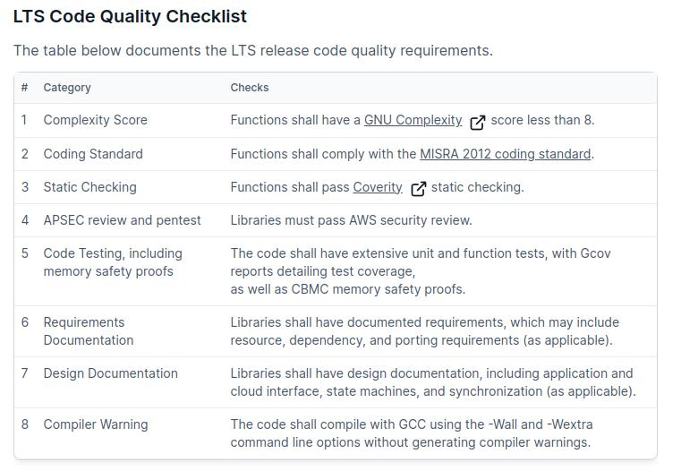
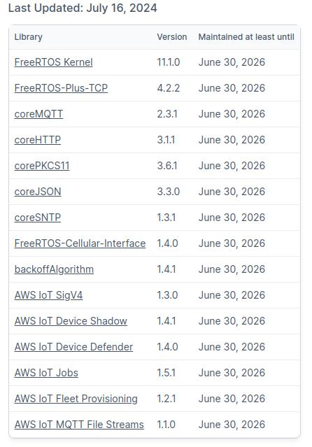

# Show me the code --- S032.FreeRTOS(7) LTS更新

## 开发环境

不清楚如何搭建开发环境的朋友，请参看 S000 - 开发环境搭建：

https://www.bilibili.com/video/BV1Xm4y1V757/

## 代码仓库

github 和 gitee 双平台同步更新！

https://gitee.com/oldawei/show_me_the_code

https://github.com/oldawei/show_me_the_code

## 免责声明

切勿用于生产环境！

因使用不当造成的任何损失，本人概不担责！

本项目中的代码，只做学习使用，没有经过严格测试，不保证结果的准确性可靠性！

## LTS

> LTS: long term support, 即 长期支持版

FreeRTOS LTS 发布的代码库严格遵循 Code Quality Checklist 以确保代码质量，这些检测措施包括：

FreeRTOS 于 2024.6.30 号发布了新的 LTS 代码库：FreeRTOSv202406.01-LTS

此次发布的 LTS 版本提供长达2年的安全问题修复和严重bug修复，维护到2026.6.30号为止。该版本具体代码库更新如下：

下载地址：https://github.com/FreeRTOS/FreeRTOS-LTS/releases/download/202406.01-LTS/FreeRTOSv202406.01-LTS.zip

## 更新内容

本次更新的代码包括：

- FreeRTOS Kernel		----> V11.1.0
- FreeRTOS-Plus-TCP    ----> V4.2.2
- FreeRTOS-Plus-CLI     ----> 官方最新版
- FreeRTOS-Plus-FAT    ----> 官方最新版
- Demo_IP_Protocols    ----> 官方最新版
- 修复 FTP server 执行 cdup 错误问题
- 通过 DHCP 获取网卡 IP 地址
- 修改 virtio net 驱动不稳定的问题
- 增加了 exception 时的打印信息

本次更新比较多，具体可对比 s031 与 s032 代码，这里不再细说。

## 演示

1. cd code/s032/

2. make clean

3. make

4. make qemu

   ping 192.168.3.10

   http://192.168.3.10:8080/

   ftp://192.168.3.10:2121/

   

5. 退出qemu: 

   **Ctrl** + **a** + **x**

## 主页

更多信息，请关注B站 **芯片人阿伟**：

https://space.bilibili.com/243180540

