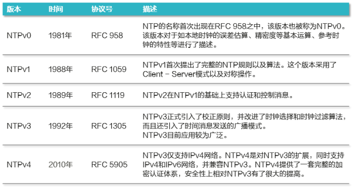
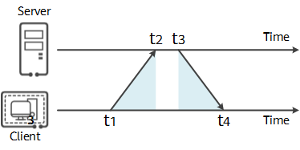
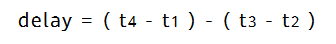
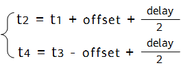
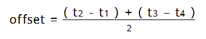

# Show me the code --- S035.FreeRTOS(8) NTP

## 开发环境

不清楚如何搭建开发环境的朋友，请参看 S000 - 开发环境搭建：

https://www.bilibili.com/video/BV1Xm4y1V757/

## 代码仓库

github 和 gitee 双平台同步更新！

https://gitee.com/oldawei/show_me_the_code

https://github.com/oldawei/show_me_the_code

## 免责声明

切勿用于生产环境！

因使用不当造成的任何损失，本人概不担责！

本项目中的代码，只做学习使用，没有经过严格测试，不保证结果的准确性可靠性！

## NTP

> NTP: Network Time Protocol, 即 网络时间协议

NTP基于UDP报文进行传输，使用的UDP端口号为123。

**NTP版本迭代：**

本次演示使用的是 NTPv3 版本

## 时间同步原理

NTP最典型的授时方式是Client/Server方式，如下图所示：

1. 客户端首先向服务端发送一个NTP请求报文，其中包含了该报文离开客户端的时间戳t1;
2. NTP请求报文到达NTP服务器，此时NTP服务器的时刻为t2。当服务端接收到该报文时，NTP服务器处理之后，于t3时刻发出NTP应答报文。该应答报文中携带报文离开NTP客户端时的时间戳t1、到达NTP服务器时的时间戳t2、离开NTP服务器时的时间戳t3；
3. 客户端在接收到响应报文时，记录报文返回的时间戳t4。

客户端用上述4个时间戳参数就能够计算出2个关键参数：

- NTP报文从客户端到服务器的往返延迟delay。

  

- 客户端与服务端之间的时间差offset。

  根据方程组：

  

  可以解得时间差为：

  

NTP客户端根据计算得到的offset来调整自己的时钟，实现与NTP服务器的时钟同步。

## 演示

1. cd code/s035/

2. ./build.sh qemu

   退出qemu: **Ctrl** + **a** + **x**

3. ./build.sh clean

## 主页

更多信息，请关注B站 **芯片人阿伟**：

https://space.bilibili.com/243180540

